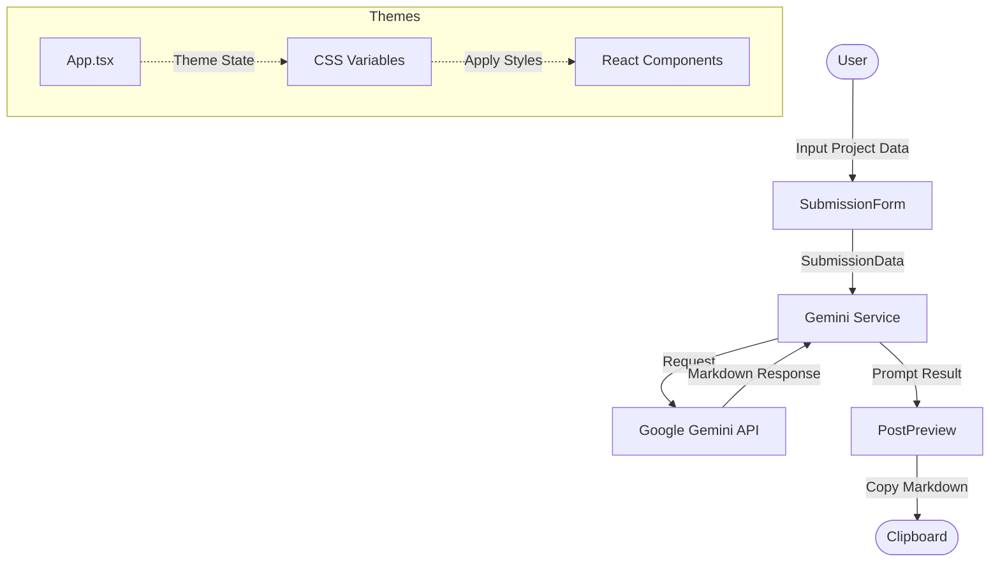

# 🏗️ ForkToPost Architecture

This document outlines the architectural design and technical decisions of the **ForkToPost** project.

## 📌 High-Level Overview

ForkToPost is a client-side heavy React application that utilizes Google's Gemini AI to assist developers in creating submission posts for the DEV.to community. The core philosophy is to provide an immersive, themed environment that reduces the cognitive load of technical writing.

## 🗺️ System Design

The application follows a simple unidirectional data flow pattern:

## 🏗️ Component Breakdown

### 1. `App.tsx` (The Orchestrator)
- Manages the global state: selected theme, loading status, and the generated post.
- Handles the high-level routing/switching between the form and the preview.
- Injects theme-specific particles and background effects.

### 2. `SubmissionForm.tsx` (Data Capture)
- Provides two modes: `custom` (field-based) and `template` (README-based).
- Collects structured data (Repo Name, Tech Stack, Problem Solved, etc.).
- Validates inputs before triggering the AI generation.

### 3. `geminiService.ts` (API Integration)
- Encapsulates the logic for interacting with `@google/genai`.
- Construct specialized prompts based on the user's input and selected mode.
- Uses the `gemini-3.1-pro-preview` model for optimal technical writing quality.

### 4. `PostPreview.tsx` (Presentation)
- Renders the generated Markdown using `react-markdown` and `remark-gfm`.
- provides a themed preview that matches the rest of the application.
- Includes a copy-to-clipboard utility.

## 🎨 Theming System

The application uses a CSS Variable based theming system.

- **Storage**: The selected theme is persisted in `localStorage`.
- **Implementation**: `data-theme` attribute on the `<html>` element.
- **Styling**: Tailwind CSS variables and custom utility classes in `index.css` respond to the data attribute.
- **Dynamics**: Theme-specific React components (like particles/glows) are rendered conditionally inside `App.tsx`.

## 🛠️ Tech Stack Decisions

- **React 19**: Chosen for the latest performance improvements and experimental features.
- **TypeScript**: Ensures type safety across the application, especially for complicated AI prompt data structures.
- **Tailwind CSS 4**: Utilized for its modernized JIT engine and fluid design system capabilities.
- **Motion**: Provides the smooth micro-animations that make the immersive themes feel "alive".
- **Gemini AI**: Selected for its superior reasoning in technical writing and ease of integration via the `@google/genai` SDK.
