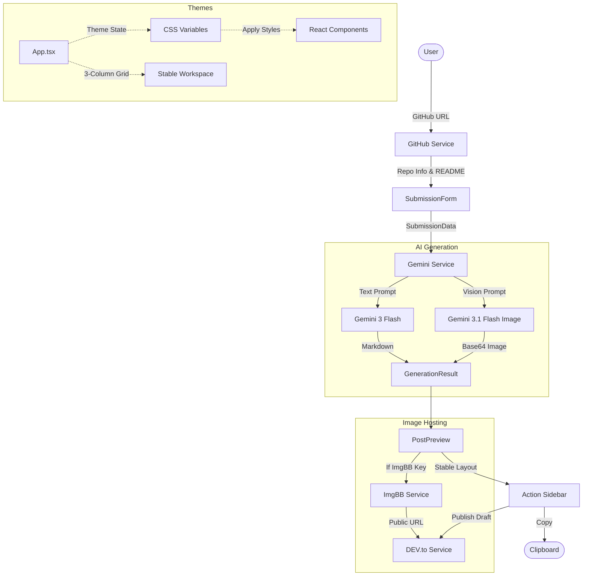

# 🏗️ ForkToPost Architecture

This document outlines the architectural design and technical decisions of the **ForkToPost** project.

## 📌 High-Level Overview

ForkToPost is a client-side heavy React application that utilizes Google's Gemini AI to assist developers in creating submission posts for the DEV.to community. The application provides an immersive, themed environment with multimodal capabilities, generating both text and visual assets.

## 🗺️ System Design

The application follows a multimodal generation flow:

## 🏗️ Component Breakdown

### 1. `App.tsx` (The Orchestrator)
- Manages global state: theme, loading status, and generated artifacts (text/image).
- Orchestrates particle effects and background shaders via `motion` and custom CSS.
- Handles theme persistence in `localStorage`.

### 2. `SubmissionForm.tsx` (Data Capture)
- **Dual Modes**: Supports `custom` (field-based) and `template` (README-based).
- **GitHub Linker**: Features an automated check that fetches basic repo stats and README content directly from GitHub API.
- **Advanced Flags**:
    - `addEmpathy`: Triggers a tone override in the AI prompt for emotional resonance.
    - `includeArchitecture`: Requests a structured technical deep-dive in the output.
    - `generateImage`: Enables the parallel image generation flow.
- **Template Logic**: Automatically wraps YouTube and Cloud Run URLs in Liquid tags (``).

### 3. `geminiService.ts` (Multimodal Integration)
- Interfaces with `@google/genai` using two specific models:
    - **Text**: `gemini-3-flash-preview` handles the narrative and layout.
    - **Image**: `gemini-3.1-flash-image-preview` generates cinematic visual metaphors.
- **Prompt Engineering**: Dynamically constructs instructions for tone, structure, and scannability.
- **Attribution**: Appends a project credit footer to every generated post.

### 4. `PostPreview.tsx` (Presentation)
- Renders Markdown via `react-markdown` with GFM support.
- Displays generated cover images with themed metadata overlays.
- **Integrated Actions**: Hosts the "Copy" and "Publish" triggers in a dedicated sidebar to maintain layout stability.
- **Image Handling**: Detects if an image is a local data URI or a URL. If a data URI is present and an ImgBB key is provided, it automatically uploads the image before drafting on DEV.to.
- **DEV.to Bridge**: Handles the API key input, fetches real-time **user profile data** (avatar/username) for verification, and prepares metadata for direct publishing.

## 🎨 Theming System

The system leverages CSS Variables and the `data-theme` attribute for real-time visual shifts.
- **Visuals**: Themes like `Sea` and `Forest` use custom SVG filters (caustics) and dynamic particle systems.
- **Typography**: Each theme defines its own font stack (Display, Serif, Mono).
- **Styling**: Tailwind CSS 4 utility classes react to theme-specific color tokens (e.g., `text-biolume`, `bg-parchment`).

## 🔌 Services & Integration

### 5. `Services/API` (External Bridges)
- **GitHubService**: Automated retrieval of repository metadata and README data for zero-effort form filling.
- **DevToService**: Integration with DEV.to API via Vite proxy for profile verification and article drafting.
- **ImgBBService**: Converts AI-generated base64 images into public URLs via a secure API gateway.
- **GeminiService**: Central gateway for multimodal AI generation (Text Narrative + Visual Metaphor).

## 🛠️ Tech Stack Decisions

- **React 19**: Chosen for high-performance rendering and modern hooks.
- **Google Gemini 3 (Flash)**: Selected for lightning-fast text generation and cost efficiency.
- **Google Gemini 3.1 (Flash Image)**: Provides high-quality visual metaphors for software projects.
- **Motion**: Powers micro-animations and immersive background interactions.
- **Tailwind CSS 4**: Modernized JIT styling system.

## ⚙️ Environment Configuration

The following variables are required for full functionality:

- `GEMINI_API_KEY`: Your Google AI Studio API Key.
- `MODEL_NAME_TEXT`: Set to `gemini-3-flash-preview`.
- `MODEL_NAME_IMAGE`: Set to `gemini-3.1-flash-image-preview`.
- `APP_URL`: The deployment URL for linking purposes.

> Never commit your .env file to version control.